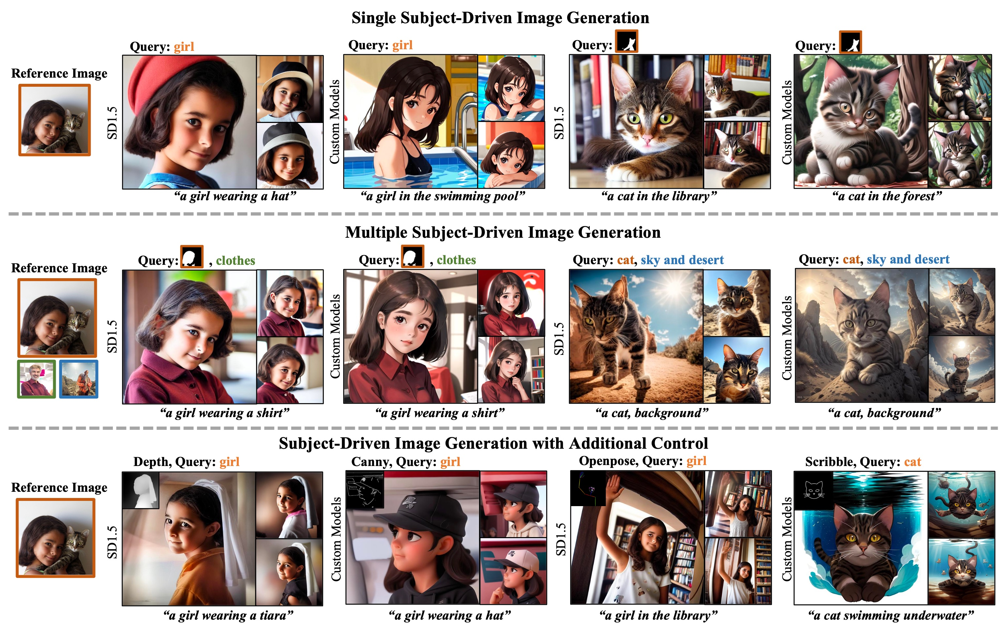
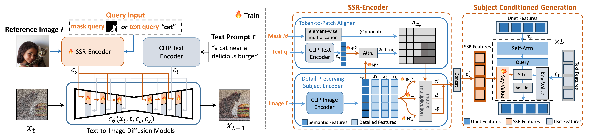

# SSR-Encoder: Encoding Selective Subject Representation for Subject-Driven Generation

<a href="https://arxiv.org/pdf/2312.16272.pdf"></a>

Our SSR-Encoder is a model generalizable encoder, which is able to guide any customized diffusion models for single subject-driven image generation (top branch) or multiple subject-driven image generation from different images (middle branch) based on the image representation selected by the text query or mask query without any additional test-time finetuning. Furthermore, our SSR-Encoder can also be applied for the controllable generation with additional control (bottom branch).
## Method Details

Given a query text-image pairs, the SSR-Encoder employs a token-to-patch aligner to highlight the selective regions in the reference image by the query. It extracts more fine-grained details of the subject through the detail-preserving subject encoder, projecting multi-scale visual embeddings via the token-to-patch aligner. Then, we adopt subject-conditioned generation to generate specific subjects with high fidelity and creative editability. During training, we adopt reconstruction loss and embedding consistency regularization loss for selective subject-driven learning.

## Todo List
The code and model weights are undergoing compliance review ...
1. - [ ] inference and training code
2. - [ ] pre-trained weights

## Citation
```
@article{zhang2023ssr,
  title={Ssr-encoder: Encoding selective subject representation for subject-driven generation},
  author={Zhang, Yuxuan and Liu, Jiaming and Song, Yiren and Wang, Rui and Tang, Hao and Yu, Jinpeng and Li, Huaxia and Tang, Xu and Hu, Yao and Pan, Han and others},
  journal={arXiv preprint arXiv:2312.16272},
  year={2023}
}
```
